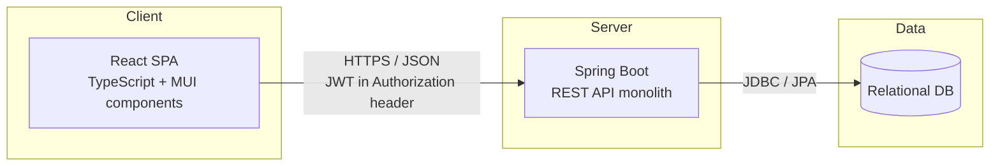

# Vehicle Maintenance & Driving Journal — High-Level Design

## 1. Architecture Overview

Simple three-tier monolith. No microservices, no message broker, no
external integrations for v1.

## 2. Components

### React Client (SPA)
- Single-page app, client-side routing (login, register, garage, vehicle
  form, dashboard, event form).
- Calls the backend exclusively via REST/JSON.
- Stores the JWT in memory (or short-lived storage) and attaches it as a
  Bearer token on every authenticated request.
- MUI (Material UI) for UI components (tables/timeline, dialogs/forms).

### Spring Boot Backend (monolith)
- Single deployable Spring Boot application exposing a REST API.
- Layered internally: Controller → Service → Repository (JPA).
- Handles authentication (issuing/validating JWTs), authorization (a user
  can only touch their own vehicles/events), and business logic (yearly km
  calculation, filtering).
- Stateless — no server-side session; JWT carries identity on each request.

### Relational Database
- Stores users, vehicles, and events.
- Accessed only by the backend, never directly by the client.
- Exact schema is defined in the low-level design.

## 3. Authentication Flow (JWT)

1. User registers or logs in via `POST /auth/register` or `POST /auth/login`.
2. On successful login, the backend issues a signed JWT containing the
   user's identity (e.g. user id) and an expiry.
3. The client stores the token and sends it as
   `Authorization: Bearer <token>` on every subsequent request.
4. The backend validates the token on each request via a filter/interceptor
   before the request reaches a controller; invalid/expired tokens get a
   401.
5. Logout is client-side (discard the token) since the backend is
   stateless — no server-side token blacklist in v1.
6. **Deferred**: refresh tokens and token revocation are planned but will
   be addressed in a later stage of implementation, not the initial pass.

## 4. Cross-Cutting Concerns (high level)

- **Authorization**: every vehicle/event query is scoped to the
  authenticated user's id — enforced at the service layer, not just the UI.
- **Validation**: request bodies validated at the controller layer (e.g.
  required date/eventType, odometer non-negative if present).
- **Error handling**: a global exception handler maps domain/validation
  errors to consistent JSON error responses with appropriate HTTP status
  codes.
- **Logging**: standard Spring Boot logging; nothing beyond default
  needed for a demo app.

## 5. Tech Stack

| Layer | Technology |
|---|---|
| Frontend | React, TypeScript, MUI (Material UI) + MUI X Charts |
| Backend | Spring Boot, Spring Web, Spring Security (JWT), Spring Data JPA |
| Database | Relational (e.g. PostgreSQL) |
| Build | Gradle (backend), npm/vite (frontend) |
| CI | GitHub Actions — run backend + frontend tests, build artifacts |

## 6. Deployment / Environment (demo scope)

- Single backend deployable + single frontend build, no separate
  environments needed beyond local dev for a demo project.
- Local dev: DB in Docker, backend run from IDE, frontend dev server on its
  own port — frontend and backend run as separate origins, with CORS
  configured on the backend (not a dev proxy), matching how they're
  deployed as separate hosts in production too. Details in LLD.

## 7. Non-Goals (v1)

- Email verification / password reset (no email server).
- Multi-user sharing of vehicles.
- Mobile app / offline support.
